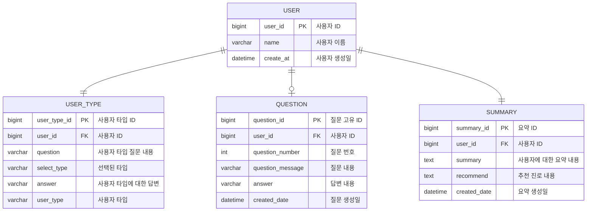

## 진로 상담 서비스 ERD

```mermaid
erDiagram

     USER {
        bigint user_id PK "사용자 ID"
        varchar name "사용자 이름"
        datetime create_at "사용자 생성일"
    }
    
    QUESTION {
        bigint question_id PK "질문 고유 ID"
        bigint user_id FK "사용자 ID"
        int question_number "질문 번호"
        varchar question_message "질문 내용"
        varchar answer "답변 내용"
        datetime created_date "질문 생성일"
    }
    
    SUMMARY {
        bigint summary_id PK "요약 ID"
        bigint user_id FK "사용자 ID"
        text summary "사용자에 대한 요약 내용"
        text recommend "추천 진로 내용"
        datetime created_date "요약 생성일"
    }
    
    USER_TYPE {
        bigint user_type_id PK "사용자 타입 ID"
        bigint user_id FK "사용자 ID"
        varchar question "사용자 타입 질문 내용"
        varchar select_type "선택된 타입"
        varchar answer "사용자 타입에 대한 답변"
        varchar user_type "사용자 타입"
    }
    
    USER ||--|| USER_TYPE : ""
    USER ||--o| QUESTION : ""
    USER ||--|| SUMMARY : ""
    
```