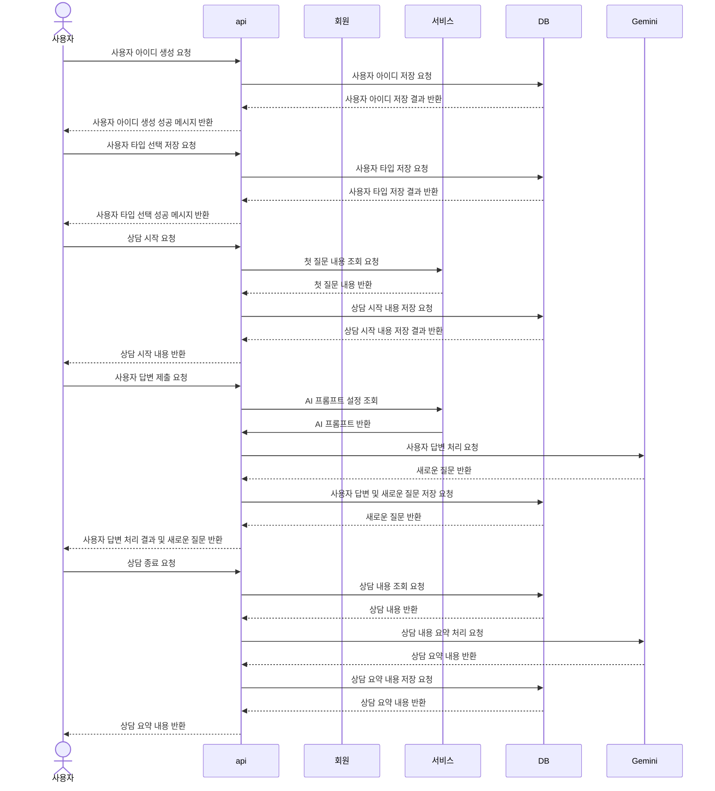

## 진로 상담 서비스 시퀀스 다이어그램

```mermaid
sequenceDiagram
actor 사용자
participant api
participant 회원
participant 서비스
participant DB
participant Gemini

    사용자 ->> api: 사용자 아이디 생성 요청
    api ->> DB: 사용자 아이디 저장 요청
    DB -->> api: 사용자 아이디 저장 결과 반환
    api -->> 사용자: 사용자 아이디 생성 성공 메시지 반환

    사용자 ->> api: 사용자 타입 선택 저장 요청
    api ->> DB: 사용자 타입 저장 요청
    DB -->> api: 사용자 타입 저장 결과 반환
    api -->> 사용자: 사용자 타입 선택 성공 메시지 반환

    사용자 ->> api: 상담 시작 요청
    api ->> 서비스: 첫 질문 내용 조회 요청
    서비스 -->> api: 첫 질문 내용 반환
    api ->> DB: 상담 시작 내용 저장 요청
    DB -->> api: 상담 시작 내용 저장 결과 반환
    api -->> 사용자: 상담 시작 내용 반환

    사용자 ->> api: 사용자 답변 제출 요청
    api ->> 서비스: AI 프롬프트 설정 조회
    서비스 ->> api: AI 프롬프트 반환
    api ->> Gemini: 사용자 답변 처리 요청
    Gemini -->> api: 새로운 질문 반환
    api ->> DB: 사용자 답변 및 새로운 질문 저장 요청
    DB -->> api: 새로운 질문 반환
    api -->> 사용자: 사용자 답변 처리 결과 및 새로운 질문 반환

    사용자 ->> api: 상담 종료 요청
    api ->> DB: 상담 내용 조회 요청
    DB -->> api: 상담 내용 반환
    api ->> Gemini: 상담 내용 요약 처리 요청
    Gemini -->> api: 상담 요약 내용 반환
    api ->> DB: 상담 요약 내용 저장 요청
    DB -->> api: 상담 요약 내용 반환
    api -->> 사용자: 상담 요약 내용 반환
```